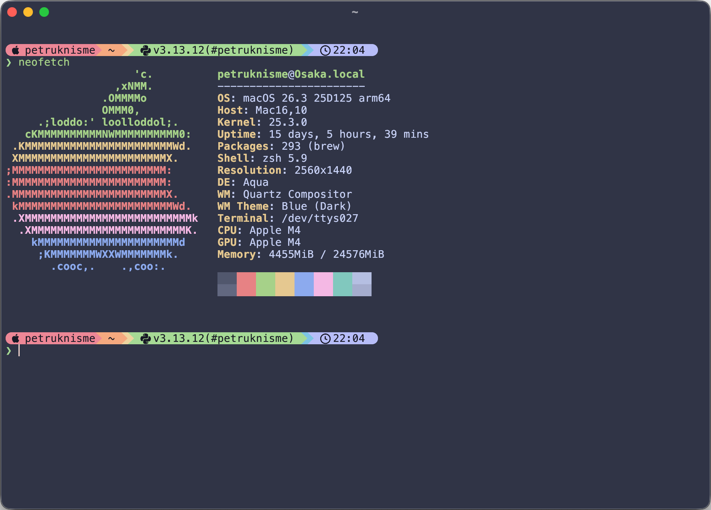
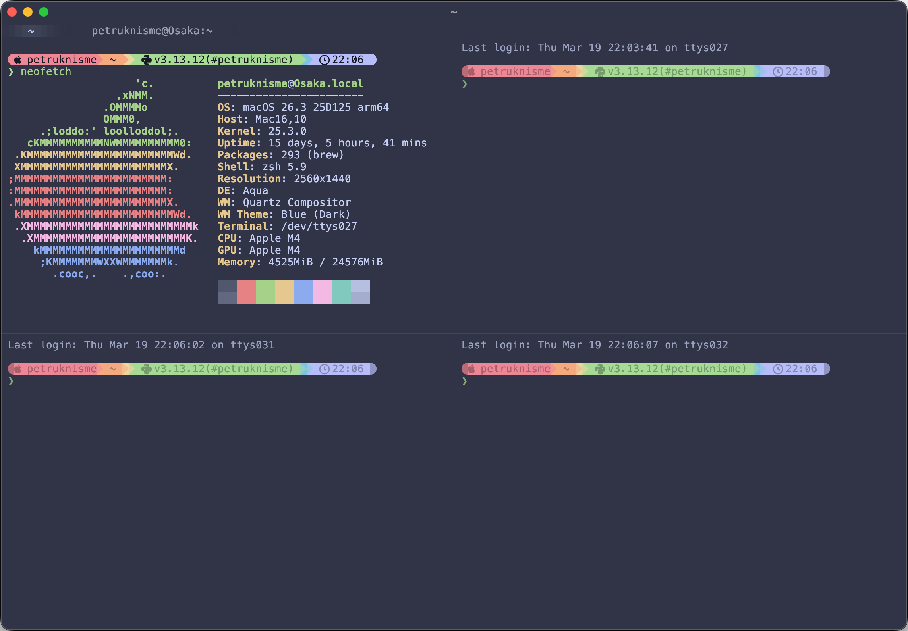

# Kitty Config (Ghostty‑Inspired)

A clean, GUI‑friendly Kitty setup inspired by Ghostty: minimal chrome, subtle split borders, mouse‑first actions, and macOS‑friendly shortcuts.

## Features
- Clean look with Catppuccin Frappe theme
- Subtle split borders only when you split
- Unfocused panes dimmed for focus
- Interactive scrollbar with autohide
- Background job notifications (visual + desktop)
- Minimal tab bar that only appears with 2+ tabs
- **Fixed-width tabs** — uniform tab sizes with padded/truncated titles
- Ghostty‑style mouse shortcuts and macOS keybindings
- URL detection and clickable links
- Smooth window resizing (pixel‑based)
- Large scrollback history

## Screenshots



## Requirements
- Kitty terminal
- Font: `JetBrainsMono Nerd Font Mono`
- [fzf](https://github.com/junegunn/fzf) (for tab switcher)
- [jq](https://github.com/jqlang/jq) (for tab switcher)
  - If Kitty is launched from the GUI, ensure these binaries are discoverable.
  - The included `kitty-tab-switcher` script uses Homebrew defaults and falls back to `command -v`.

## Install
1. Clone or copy this repo to your Kitty config directory:
   - macOS/Linux default: `~/.config/kitty`
2. Start Kitty or reload the config.

## Reload Config
- Restart Kitty, or
- Use `ctrl+shift+f5`

## Keybindings
- `cmd+d` split right
- `cmd+shift+d` split down
- `cmd+w` close split
- `cmd+shift+r` reset terminal (also sends Enter)
- `cmd+shift+l` clear screen
- `cmd+shift+i` change window name (macOS titlebar)
- `cmd+shift+t` change tab name (tab bar)
- `cmd+t` new tab
- `cmd+shift+left/right` previous/next tab
- `page_up` / `page_down` scroll
- `home` / `end` line navigation (requires zshrc, see below)
- `cmd+shift+e` window/split switcher (focus overlay)
- `ctrl+shift+e` fzf tab switcher (see [kitty-tab-switcher](https://github.com/OsiPog/kitty-tab-switcher))
  - Shows all tabs in an fzf overlay
  - Search by tab title, directory, or command
  - Preview is customized to a large 90% area with a compact list
  - Based on [kitty-tab-switcher](https://github.com/OsiPog/kitty-tab-switcher)
  - Requires `allow_remote_control socket-only` and `listen_on unix:/tmp/kitty-socket-{kitty_pid}` in `kitty.conf`
  - Uses `KITTY_LISTEN_ON` automatically
- `cmd+shift+f` search scrollback (opens pager in search mode)
- `cmd+shift+h` open scrollback (pager)
- `cmd+.` show last command output (formatted, overlay pager; Nerd Font icons enabled; requires shell integration)
- `cmd+o` open current directory in Finder

## Mouse Shortcuts
- **Left-click drag to select**: automatically copies to clipboard
- Right click: paste
- `ctrl` + right click: split right
- `ctrl` + `shift` + right click: split down
- `alt` + right click: close split
- `shift` + right click: reset terminal
- `ctrl` + left click on URL: open in browser
- Middle click: paste from primary selection
- Middle click on tab: close tab (kitty default)

### Copy Notification
**Current Setup**: 
- Text auto-copies when selected (via `copy_on_select clipboard`)
- Press **Cmd+C** to copy AND show "Copied!" notification
- Notification shows **only from Kitty** (not from other apps)

**How to use**:
1. **Mouse selection**: Select text with mouse → auto-copies (no notification)
2. **Keyboard copy**: Select text → press `Cmd+C` → copies + shows notification

**Why this works**:
- `Cmd+C` is mapped to both copy AND show notification
- Only triggers when you press the shortcut in Kitty
- Copying in other apps won't trigger Kitty's notification
- No background processes or clipboard monitors needed

## Menubar Actions (macOS)
- Actions → Paste
- Actions → Split Right
- Actions → Split Down
- Actions → Reset Terminal
- Actions → Change Window Name
- Actions → Change Tab Name

## Notes
- Home/End key navigation requires adding to `.zshrc`:
  ```bash
  # Home
  bindkey '\e[H'  beginning-of-line
  bindkey '\eOH'  beginning-of-line
  # End
  bindkey '\e[F'  end-of-line
  bindkey '\eOF'  end-of-line
  ```
- Splits and tabs inherit current working directory (requires shell integration in `.zshrc`)
- Splits use Kitty's `splits` layout. This is forced automatically by the shortcuts.
- `vsplit` = left/right, `hsplit` = top/bottom
- Window resizing is smooth: `window_resize_step_cells 0`
- Large scrollback: `scrollback_lines 10000`
- Close confirmation enabled: `confirm_os_window_close 1`

## Search (scrollback)
Use `cmd+shift+f`, then inside the pager:
- `/text` search forward, `?text` search backward
- `n` next match, `N` previous match
- `q` quit pager

## Background Job Notifications
When running commands with `&` (e.g., `sleep 10 &`), you'll get a visual bell when they complete.

**Manual notification** (more reliable):
```bash
# Run command then notify when done
sleep 10 && kitten notify "Done" "Command completed"
```

Or use background with notification on finish:
```bash
sleep 10 & PID=$!; wait $PID; kitten notify "Done" "sleep finished"
```

**Enable desktop notifications on macOS:**
1. Run `kitten notify "Test" "Hello"` in kitty to trigger permission request
2. Go to **System Settings → Notifications**
3. Find **kitty** in the app list and enable it

Test notification:
```bash
kitten notify "Hello" "This is a test"
```

## File Layout
- `kitty.conf` main config
- `current-theme.conf` Catppuccin Frappe theme (included)
- `Catppuccin-Frappe.conf` theme source

## Customize
Common tweaks in `kitty.conf`:
- Font size: `font_size`
- Unfocused dim: `inactive_text_alpha`
- Split border thickness: `window_border_width`
- Tab bar style: `tab_bar_style`, `tab_bar_min_tabs`
- Padding/margins: `window_padding_width`, `window_margin_width`

## Credits
- Original tab switcher by [OsiPog/kitty-tab-switcher](https://github.com/OsiPog/kitty-tab-switcher)
- Custom updates by @petruknisme (macOS socket handling, PATH fallbacks, preview layout)

---

If you want a different look (more minimal or more decorative), open an issue or tweak the values above.
